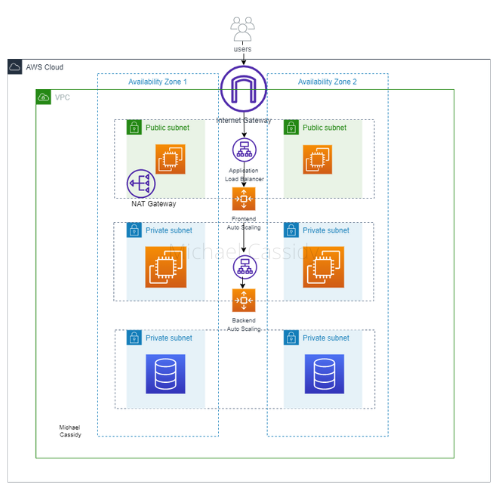

# REQS

Try to cover some aspects of this points :

- Setup EKS on AWS,egress traffic from the cluster is using just one IP address with Nat Gateway
- Auto-Scaler , Nginx autoconfig
- Dockerize & Deploy Python apps, deploy in EKS with helm + HPA
- Setup RDS Postgresql

## Apps config

Check readme inside the apps directory

## Structure Directory and multiple regions/environments strategy

Mostly managed by github actions workflows and input variables.

Also Terraform has a built-in “workspace”.

Use distinct workflow for each regions and environments,
With Command-line key/value pairs stored in github secrets.

All remote backends are separated by region/env tfstate

- Example 1: prod | eu-north-1

```
terraform init \
-backend-config="bucket=${TFSTATE_BUCKET}" \
-backend-config="key=${TFSTATE_KEY}" \
-backend-config="region=${TFSTATE_REGION}" 

 terraform plan -var-file=enviroment\prod\eu-north-1\eks.tfvars -out eu.plan 

 terraform apply eu.plan
```

- Example 2: prod | eu-north-1 | rds

```
terraform init \
-backend-config="bucket=${TFSTATE_BUCKET}" \
-backend-config="key=${TFSTATE_KEY}" \
-backend-config="region=${TFSTATE_REGION}" 

 terraform plan -var-file=enviroment\prod\eu-north-1\rds.tfvars -target=module.rds -out eu.plan 

 terraform apply eu.plan
```

- Example 3 : test | us-west-1 | eks

```
terraform init \
-backend-config="bucket=${TFSTATE_BUCKET}" \
-backend-config="key=${TFSTATE_KEY}" \
-backend-config="region=${TFSTATE_REGION}" 

 terraform plan -var-file=enviroment\prod\us-west-1\eks.tfvars -target=module.eks -out us-west-1.plan 

 terraform apply us-west-1.plan
```

```
DIRECTORY

├── environments
│   ├── prod
│   │   ├── us-east-1
│   │   └── us-west-2
│   └── test
│       ├── us-east-1
│       └── us-west-2
└── modules
    ├── database
    ├── load-balancer
    ├── vpc
    └── web-server
```


# EKS Cluster Deployment with new VPC

This example deploys the following Basic EKS Cluster with VPC




- Creates a new sample VPC, 3 Private Subnets and 3 Public Subnets
- Creates Internet gateway for Public Subnets and NAT Gateway for Private Subnets
- Creates EKS Cluster Control plane with one managed node group

## How to Deploy

### Prerequisites

Ensure that you have installed the following tools in your Mac or Windows Laptop before start working with this module and run Terraform Plan and Apply

1. [AWS CLI](https://docs.aws.amazon.com/cli/latest/userguide/install-cliv2.html)
2. [Kubectl](https://Kubernetes.io/docs/tasks/tools/)
3. [Terraform](https://learn.hashicorp.com/tutorials/terraform/install-cli)

### Minimum IAM Policy

> **Note**: The policy resource is set as `*` to allow all resources, this is not a recommended practice.

You can find the policy [here](min-iam-policy.json)

### Deployment Steps

#### Step 1: Clone the repo using the command below

```sh
git clone https://github.com/cifuab/example.git
```

#### Step 2: Run Terraform INIT

Initialize a working directory with configuration files

```sh
terraform init
```

#### Step 3: Run Terraform PLAN

Verify the resources created by this execution

```sh
export AWS_REGION=<ENTER YOUR REGION>   # Select your own region
terraform plan
```

#### Step 4: Finally, Terraform APPLY

**Deploy the pattern**

```sh
terraform apply
```

Enter `yes` to apply.

## Configure `kubectl` and test cluster

EKS Cluster details can be extracted from terraform output or from AWS Console to get the name of the cluster.
This following command used to update the `kubeconfig` in your local machine where you run kubectl commands to interact with your EKS Cluster.

#### Step 5: Run `update-kubeconfig` command

`~/.kube/config` file gets updated with cluster details and certificate from the below command

    aws eks --region <enter-your-region> update-kubeconfig --name <cluster-name>

#### Step 6: List all the worker nodes by running the command below

    kubectl get nodes

#### Step 7: List all the pods running in `kube-system` namespace

    kubectl get pods -n kube-system

## Cleanup

To clean up your environment, destroy the Terraform modules in reverse order.

Destroy the Kubernetes Add-ons, EKS cluster with Node groups and VPC

```sh
terraform destroy -target="module.eks_blueprints_kubernetes_addons" -auto-approve
terraform destroy -target="module.eks_blueprints" -auto-approve
terraform destroy -target="module.rds" -auto-approve
terraform destroy -target="module.vpc" -auto-approve
```

Finally, destroy any additional resources that are not in the above modules

```sh
terraform destroy -auto-approve
```

# Pending issues

- Deploy from github actions IaC
  - Apply multiple regions/environments strategy

- Config S3 and dynamo DB for block tfstate
- Modify CI/CD for Apps
  - Add values.yaml for different env

----
# Improvements

- EKS
  - Use node group spots
  - Karpenter
  - BattelRock Instances
- ECR
...


